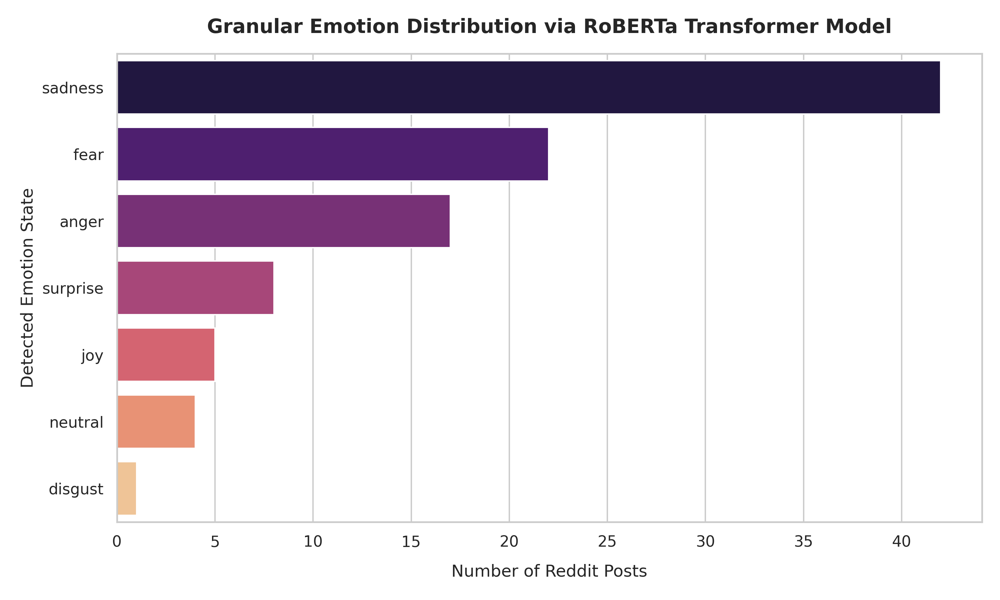
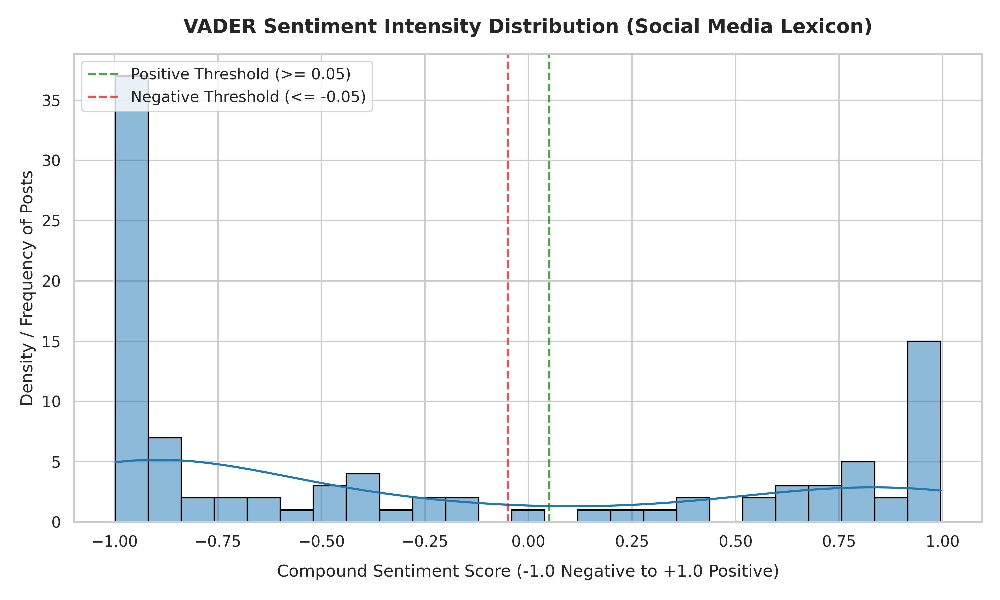
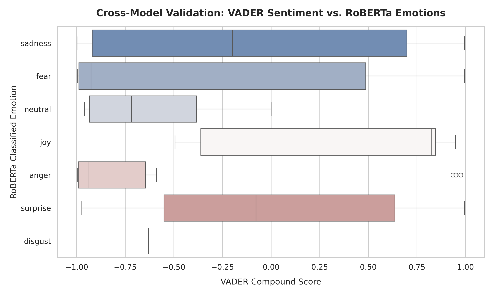

## 📌 Advanced Reddit Mental Health Analytics: A Hybrid NLP & Deep Learning Framework

## Project Overview
This project deploys a production-grade Natural Language Processing (NLP) pipeline to analyze emotional states and sentiment trends in mental health discussions on Reddit. Moving beyond basic lexicon tools, this framework implements a **Hybrid NLP Architecture**: combining a specialized social media sentiment lexicon (**VADER**) with a state-of-the-art Deep Learning Transformer model (**DistilRoBERTa**) fine-tuned for multi-class emotion classification.

The goal is to translate unstructured, highly nuanced social media text into actionable categorical insights for platform safety, content moderation, or community health tracking.

---

## 🛠️ Tech Stack & Core Libraries
* **Language:** Python 3.10+
* **Data Ingestion:** PRAW (Reddit API wrapper)
* **Data Engineering:** Pandas, NumPy
* **Lexicon NLP:** NLTK (VADER Sentiment Intensity Analyzer)
* **Deep Learning NLP:** Hugging Face Transformers (DistilRoBERTa Engine)
* **Data Visualization:** Matplotlib, Seaborn

---

## 🚀 System Architecture & Workflow
```text
[Raw Reddit Text] ➔ [Data Preprocessing & Truncation]
                         │
         ┌───────────────┴───────────────┐
         ▼                               ▼
 [VADER Lexicon]               [DistilRoBERTa Transformer]
 (Continuous Score -1 to +1)    (Multi-Class Emotion Label)
         │                               │
         └───────────────┬───────────────┘
                         ▼
        [Cross-Model Validation & Viz]
```

1. **Data Ingestion & Cleaning:** Extracted raw text data from targeted subreddits, removing structural noise, duplicates, and stripping URLs while retaining emotional punctuation cues (e.g., exclamation marks, capitalizations).
2. **Rule-Based Sentiment Profiling:** Applied VADER to compute a continuous compound score, capturing immediate textual intensity and micro-slangs common on social platforms.
3. **Deep Learning Emotion Extraction:** Routed data through a DistilRoBERTa sequence classification pipeline to map text into 6 explicit emotional vectors: *Anger, Disgust, Fear, Joy, Sadness, and Surprise*. Text inputs were systematically truncated to 512 tokens to adhere to transformer architectural limitations.
4. **Statistical Cross-Validation:** Correlated continuous sentiment scores against categorical deep learning outputs to validate model alignment and uncover nuanced edge cases.

---

## 📊 Analytical Insights & Visualizations

### 1. Granular Emotion Distribution (Deep Learning)
The DistilRoBERTa model successfully surfaces explicit emotional layers within the text data, offering a much richer analytical breakdown than standard positive/negative metrics.



### 2. VADER Sentiment Intensity Density
The compound score density plot maps the continuous distribution of text sentiment, highlighting major volume thresholds and neutral baselines.



### 3. Cross-Model Validation Analysis
By mapping VADER scores against RoBERTa categories via box plots, the system validates that deep learning emotional states structurally align with numeric sentiment scoring, highlighting how complex emotions like "Fear" skew strongly negative.



---

## 📈 Key Engineering Takeaways
* **Context Over Syntax:** Traditional rule-based dictionaries fail to interpret sarcasm or severe distress context. Integrating a Transformer model allowed the pipeline to accurately capture hidden emotional context.
* **Input Optimization:** Deployed token-truncation safe-guards to manage long-form text inputs, ensuring zero runtime exceptions during deep learning inference on un-truncated user rants.
